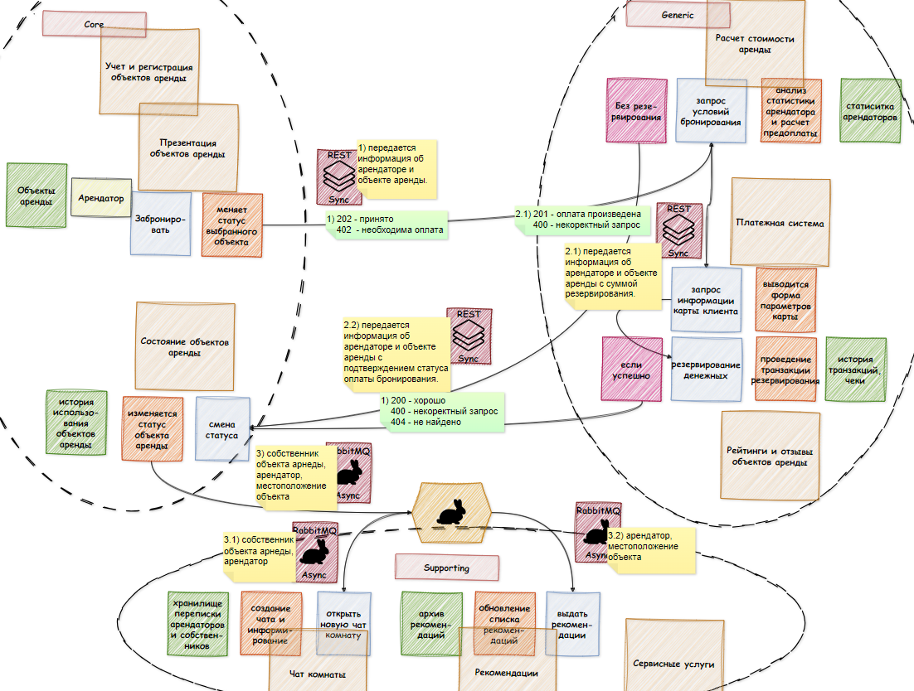

## Название Информационной Системы *(ИС)* - `Booking`
### Назначение - `Предоставляет возможность связать между собой собственников недвижимости и арендаторов. Каждая из сторон имеет свой личный кабинет` 
## Основные Бизнес Процессы *(БП)*
- **Собственник недвижимости регистрирует свой объект на сервисе.** *ИС выполняет следующие действия:*
  1)	Поднимает его учетные данные
  2)	Проводит собственника по PipeLine регистрации объекта
- **Пользователь заходит на платформу и сразу получает доступ к карте с объектами аренды. Вводит город или объект на карте, возле которого хочет арендовать жилье.**  *ИС выполняет следующие действия:*
  1)	Выводит фильтр по критериям объектов и показывает их на карте
  2)	Рассчитывает стоимость по указанным датам
  3)	Выдает рекомендации выгодных предложений, с учетом отзывов
- **Пользователь бронирует объект**, *ИС выполняет следующие действия:*
  1)	По доверию к клиенту резервирует денежные средства, или производит бронирование бесплатно
  2)	Оповещает клиента о деталях заказа и условиях отмены бронирования
- **Пользователь заселяется в объект**, *ИС выполняет следующие действия:*
  1)	Открывает двухсторонний чат пользователя и собственника
  2)	Предлагает в случае выявления несоответствия написать об этом системе и приложить фото
  3)	Списывает денежные средства со счета клиента
  4)	В ЛК пользователя появляются рекомендации по использованию окружающей инфраструктуре
- **По истечению времени аренды**, *ИС выполняет следующие действия:*
  1)	Информирует о времени выезда
  2)	Предлагает написать отзыв
  3)	После написания отзыва выставляет рейтинг клиенту и собственнику
  4)	В ЛК собственника предлагает услуги по service room

## Микросервисы, и их назначение
1) **Система учета и регистрации объектов аренды**
    - Обрабатывает запросы на добавление объекта недвижимости, внесение технических характеристик.
    - Хранит информацию по доступным объектам недвижимости.
2) **Система презентации объектов аренды**
    - Обрабатывает запросы на показ объектов на карте по фильтру.
    - Кэширует результаты запросов отображения.
    - Хранит историю запросов пользователей.
3) **Система расчета стоимости аренды**
    - Обрабатывает запрос получения цен объектов с учетом рейтинга пользователей.
    - Вычисляет по формуле с учетом указанного периода стоимость аренды.
    - Вычисляет условия бронирования под конкретного пользователя.
4) **Система чат комнаты**
    - Обрабатывает запрос на открытие чата между пользователем и собственником.
    - Хранит историю диалогов.
    - Хранит инструкции для пользователя по конкретному объекту.
5) **Система состояний объектов аренды**
    - Регистрирует бронирование объектов, отмены бронирования.
    - Регистрирует приемку объекта в аренду и начало периода использования, прерывания периода аренды и окончания аренды.
    - Хранит историю использования объектов аренды.
6) **Система рейтингов и отзывов объекта аренды**
    - Регистрирует отзыв пользователя об объекте.
    - Реализует диалог обратной связи.
    - Вычисляет рейтинг объектов.
7) **Система сервисных услуг**
    - Регистрирует обязательный сервис для объекта аренды после истечения срока аренды.
    - Регистрирует необходимые опции для объекта аренды перед началом срока аренды.
8) **Платежная система**
    - Реализует систему резервации и списания денежных средств.
    - Хранит историю денежных операций(чеки).
9) **Система рекомендаций**
    - Обрабатывает запрос пользователя показать ближайшие объекты инфраструктуры используя сторонние сервисы. 

## Оценка сложности микросервисов
|Контекст|Конкурентное преимущество|Сложность, стоимость реализации|Тип приоритета|
|:-|:---:|:---:|:-:|
|Учет и регистрация объектов аренды|L|L|Core|
|Презентация объектов аренды|L|L|Core|
|Состояние объектов аренды|L|M|Core|
|Расчет стоимости аренды|M|M|Generic|
|Платежная система|M|M|Generic|
|Рейтинги и отзывы объектов аренды|M|S|Generic|
|Чат комнаты|M|S|Supporting|
|Сервисные услуги|S|S|Supporting|
|Рекомендации|S|S|Supporting|

## Визуальная схема бизнес процесса бронирования объекта аренды.

### Описание взаимодействие сервисов в рамках одного из бизнес-сценариев:
### `Бронирование объекта аренды`
1) Арендатор вызывает команду `Забронировать` в микросервисе ***Презентация объектов аренды***
    - формируется REST запрос на **EndPoint** `Запрос условий бронирования` в микросервисе ***Расчет стоимости аренды***
    - данные для передачи: информацией об арендаторе и объекте аренды
    - ожидаемый ответ: 202 - принято, 402 - необходима оплата
2) Если приходит 402 ответ, то происходит редирект на форму оплаты с запросов данных по оплате. 
    - формируется REST запрос на **EndPoint** `Запрос информации карты клиента` в микросервисе ***Платежная система***
    - Переход в сервис обработки запроса на **EndPoint** `Резервирование денежных` в микросервисе ***Платежная система***
    - данные для пердачи: информация об арендаторе и объекте аренды с суммой оплаты и данными платежной системы.
    - ожидаемый ответ: 201 - оплата произведена, 400 - некорректный запрос.
3) Если оплата не требуется или произведена успешно происходит вызов REST  **EndPoint** `Смена статуса` в микросервисе ***Расчет стоимости аренды***
    - Данные для передачи: инфомрация об арендаторе, объекте аренды с подтверждением статуса оплаты.
    - ожидаемый ответ: 200 - регистрация создана, 400 - некоректный зарпос, 404 - не найдены данные.
4) После изменения статуса объекта аренды отправляется асинхронный запрос AMQP в общую очерень брокера.
    - данные передачи: собственник объекта аренды, арендатор, локация объекта.
    - ответ не ожидается.
5) Данную очередь слушают два микросервиса:
    - обработчик `открыть новую чат комнату` в микросервисе ***Чат комнаты***
    - обработчик `выдать рекомендации` в микросервисе ***Рекомендации***
## паттерн ***Strangler*** для `Система презентации объектов аренды`
Регистрируем **Презентацию объектов аренды** в двух системах до отдельного уведомления
|Этап|Кол-во участников|Критерии отбора|Условия перехода на этап|План на случаи проблем|
|:-:|:---:|:---:|:-:|:-:|
|1|5% участников, удовлетворяющие критериям|Пользователи, которые уже совершали поиск объектов (минимум 2 раза за последние 6 месяцев, и успешно арендовали объект минимум 1 раз)|Сервис готов, протестировани и задеплен на прод. Получены все разрешения ИТ, СБ.|В случае ошибки в показанной информации об объекте (цена, расположение, статус) - выдает клиенку купон на скидку (10%), если данные расходятся из старой системы, В случае простоя объекта из-за пропуска его в показах - предоставлять подъем рейтинга объекта|
|2|40% участников, удовлетворяющие критериям, при этом не участвующие в первом этапе|Пользователи, которые уже совершали поиск объектов (минимум 2 раза за последние 6 месяцев, и успешно арендовали объект минимум 1 раз)|Этап 1 проработал месяц подряд без использования опций "план на случаи проблем" при минимальном совершении 500 запросов|В случае ошибки в показанной информации об объекте (цена, расположение, статус) - выдает клиенку купон на скидку (20%), если данные расходятся из старой системы, В случае простоя объекта из-за пропуска его в показах - предоставлять подъем рейтинга объекта. Критичные проблемы возвращают на 1й этап|
|3|100% участников|-|Этап 2 проработал 2 месяца  подряд без использования опций "план на случаи проблем" при минимальном совершении 5000 запросов|В случае простоя объекта из-за пропуска его в показах - предоставлять подъем рейтинга объекта. Критичные проблемы возвращают на 2й этап|
|4|отключение старой системы|-|-|-|